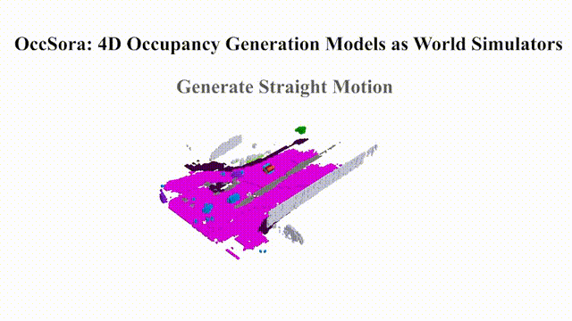
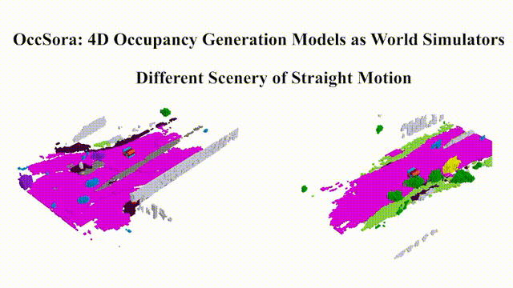
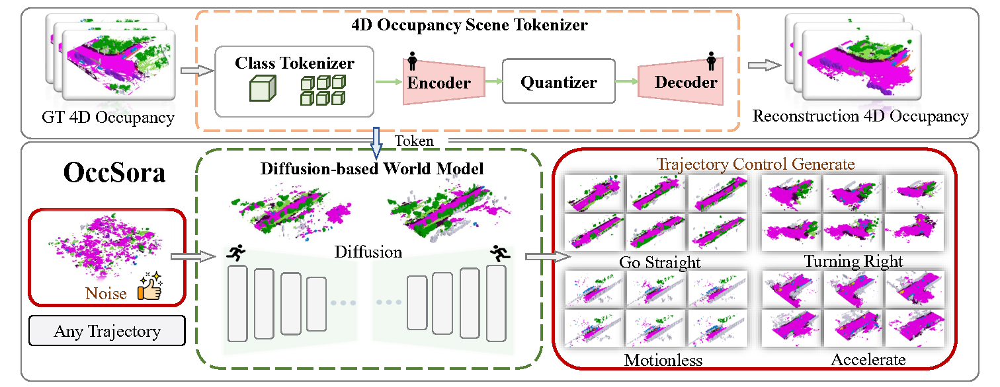

# OccSora: 4D Occupancy Generation Models as World Simulators for Autonomous Driving

### [Paper](https://arxiv.org/)  | [Project Page](https://wzzheng.net/OccSora) 


> OccSora: 4D Occupancy Generation Models as World Simulators for Autonomous Driving

> [Lening Wang](https://github.com/LeningWang)*, [Wenzhao Zheng](https://wzzheng.net/)\* $\dagger$, [Yilong Ren](https://shi.buaa.edu.cn/renyilong/zh_CN/index.htm), [Han Jiang](https://scholar.google.com/citations?user=d0WJTQgAAAAJ&hl=zh-CN&oi=ao), [Zhiyong Cui](https://zhiyongcui.com/), [Haiyang Yu](https://shi.buaa.edu.cn/09558/zh_CN/index.htm), [Jiwen Lu](http://ivg.au.tsinghua.edu.cn/Jiwen_Lu/)

\* Equal contribution $\dagger$ Project leader


## News

- **[2024/05/30]** Training, evaluation, and visualization code release.
- **[2024/05/30]** Paper released on [arXiv](https://arxiv.org/abs/2405.).


## Demo

### Trajectory Video Generation:



### Scene Video Generation:



## Overview


The pipeline of OccSora. The 4D occupancy scene tokenizer achieves compression and restoration of real information. The compressed information and vehicle trajectories are simultaneously used as inputs for the diffusion-based world model, generating trajectory-controllable tokens that are decoded into 4D occupancy.


## Getting Started

### Installation
1. Create a conda environment with Python version 3.8.0

2. Install all the packages in environment.yaml

3. Please refer to [mmdetection3d](https://mmdetection3d.readthedocs.io/en/latest/getting_started.html#installation) about the installation of mmdetection3d

### Preparing
1. Create a soft link from data/nuscenes to your_nuscenes_path

2. Prepare the gts semantic occupancy introduced in [Occ3d]

3. Download the generated [train/val pickle files]( https://github.com/wzzheng/TPVFormer/tree/main) and put them in data/

    [nuscenes_infos_train_temporal_v3_scene.pkl]

    [nuscenes_infos_val_temporal_v3_scene.pkl]

  The dataset should be organized as follows:

```
OccSora/data
    nuscenes                 -    downloaded from www.nuscenes.org
        lidarseg
        maps
        samples
        sweeps
        v1.0-trainval
        gts                  -    download from Occ3d
    nuscenes_infos_train_temporal_v3_scene.pkl
    nuscenes_infos_val_temporal_v3_scene.pkl
```


### Training
Train the VQVAE on A100 with 80G GPU memory.
```
python train_1.py --py-config config/train_vqvae.py --work-dir out/vqvae
```
Generate training Token data using the vqvae results
```
python step02.py --py-config config/train_vqvae.py --work-dir out/vqvae
```
Train the OccSora on A100 with 80G GPU memory. 
```
torchrun --nnodes=1 --nproc_per_node=8 train_2.py --model DiT-XL/2 --data-path /path
```
### Evaluation
Evaluate the model on A100 with 80G GPU memory.  

The token is obtained by denoising the noise samples_array.npy
```
python sample.py --model DiT-XL/2 --image-size 256 --ckpt "/results/001-DiT-XL-2/checkpoints/1200000.pt"
```
### Visualization


```
python visualize_demo.py --py-config config/train_vqvae.py --work-dir out/vqvae
```

## Related Projects

Our code is based on [OccWorld](https://github.com/wzzheng/OccWorld) and [DiT](https://github.com/facebookresearch/DiT). 

Also thanks to these excellent open-sourced repos:
[TPVFormer](https://github.com/wzzheng/TPVFormer) 
[MagicDrive](https://github.com/cure-lab/MagicDrive)
[BEVFormer](https://github.com/fundamentalvision/BEVFormer)

## Citation

If you find this project helpful, please consider citing the following paper:
```
@article{
}
```